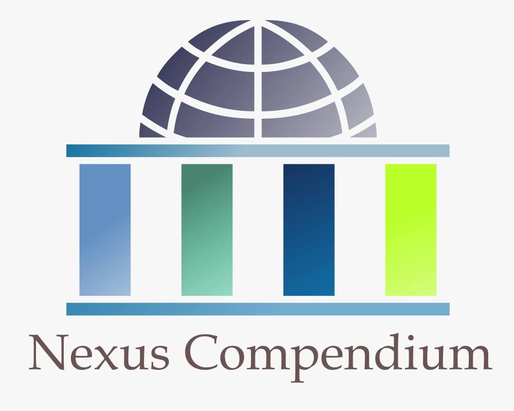

# Nexuscompendium - Plataforma de Gestión de Proyectos de Vinculación con el Medio


[](https://laravel.com)
[](https://php.net)
[](LICENSE)

## 📋 Descripción del Proyecto

Nexuscompendium es una plataforma web desarrollada en Laravel que facilita la gestión y coordinación de proyectos de vinculación con el medio. Su objetivo principal es servir como un punto central donde se concentra y organiza toda la información, conectando instituciones educativas con las necesidades reales de la comunidad y promoviendo el aprendizaje experiencial y el impacto social positivo.

## 🎯 Objetivo Académico

Establecer la identidad visual y la estructura de vistas de un nuevo proyecto en Laravel, demostrando la capacidad para crear una marca coherente y construir vistas web utilizando rutas y el motor de plantillas Blade.

## ✨ Características Principales

### Fase 1 - Identidad Visual y Estructura
- **Identidad de Marca**: Nombre, logo y paleta de colores cohesiva
- **Estructura de Vistas**: Sistema completo de plantillas Blade
- **Navegación Intuitiva**: Interfaz amigable y responsive
- **Diseño Profesional**: Utilizando principios modernos de UX/UI

## 🚀 Demo y Capturas

### Vista Principal


### Características Implementadas
- 🏠 **Página de Bienvenida**: Hero section con identidad visual completa
- 📋 **Gestión de Proyectos**: CRUD de proyectos con filtros y búsqueda
- 🔐 **Sistema de Autenticación**: Páginas de login con diseño profesional
- 📊 **Dashboard**: Panel de control preparado para futuras funcionalidades
- 🎨 **Diseño Responsivo**: Optimizado para móviles y escritorio

### URLs Disponibles
- **Inicio**: `/`
- **Proyectos**: `/proyectos`
- **Crear Proyecto**: `/proyectos/crear`
- **Ver Proyecto**: `/proyectos/{id}`
- **Login**: `/login`
- **Dashboard**: `/dashboard`

## 🎨 Identidad Visual

### Marca: Nexuscompendium
- **Concepto**: Nexus (conexión) + Compendium (conocimiento)
- **Logo**: Nodo central con conexiones radiales simbolizando la convergencia del conocimiento
- **Colores Principales**:
  - Azul Claro: `#6290C3`
  - Verde Claro: `#C2E7DA`
  - Verde Muy Claro: `#F1FFE7`
  - Azul Oscuro: `#1A1B41`
  - Verde Brillante: `#BAFF29`

### Principios de Diseño
- ✨ Simplicidad y claridad
- 🎯 Accesibilidad universal
- 📱 Diseño responsive
- 💼 Profesionalismo

## 🛠️ Tecnologías Utilizadas

- **Framework**: Laravel (PHP)
- **Frontend**: Blade Templates + CSS personalizado
- **Fuentes**: Google Fonts (Inter)
- **Iconos**: Emojis Unicode para compatibilidad universal
- **Metodología**: Mobile-first, Progressive Enhancement

## 📁 Estructura del Proyecto

```
Nexuscompendium/
├── .github/
│   └── copilot-instructions.md     # Instrucciones para GitHub Copilot
├── public/
│   └── css/
│       └── app.css                 # Estilos principales
├── resources/
│   └── views/
│       ├── layouts/
│       │   └── app.blade.php       # Plantilla maestra
│       ├── proyectos/
│       │   ├── index.blade.php     # Lista de proyectos
│       │   ├── create.blade.php    # Crear proyecto
│       │   └── show.blade.php      # Detalles del proyecto
│       ├── auth/
│       │   └── login.blade.php     # Página de login
│       ├── welcome.blade.php       # Página de bienvenida
│       └── dashboard.blade.php     # Panel de control
├── routes/
│   └── web.php                     # Definición de rutas
├── BRANDING.md                     # Documentación de marca
├── VERIFICACION_RUBRICA.md         # Verificación de cumplimiento
└── README.md                       # Este archivo
```

## 🚀 Rutas Implementadas

| Ruta | Vista | Descripción |
|------|-------|-------------|
| `GET /` | `welcome.blade.php` | Página principal de bienvenida |
| `GET /proyectos` | `proyectos/index.blade.php` | Lista de proyectos |
| `GET /proyectos/crear` | `proyectos/create.blade.php` | Formulario de creación |
| `GET /proyectos/{id}` | `proyectos/show.blade.php` | Detalles del proyecto |
| `GET /login` | `auth/login.blade.php` | Página de autenticación |
| `GET /dashboard` | `dashboard.blade.php` | Panel de control |

## 📱 Características de las Vistas

### 5 Vistas Completamente Diseñadas:
1. **Welcome**: Hero section, características, estadísticas y call-to-action
2. **Proyectos Index**: Lista con filtros, tarjetas de proyecto y paginación
3. **Crear Proyecto**: Formulario completo con validación y tips de ayuda
4. **Detalles Proyecto**: Información completa, cronograma y participantes
5. **Login**: Formulario de autenticación con diseño profesional

### 1 Vista Básica:
6. **Dashboard**: Placeholder con mensaje de funcionalidad en desarrollo

## 🎨 Componentes de Diseño

### Sistema de Grid Responsivo
- Grid de 2 columnas para layouts principales
- Grid de 3 columnas para tarjetas y elementos
- Adaptación automática en dispositivos móviles

### Componentes Reutilizables
- **Botones**: Primario, secundario y outline
- **Tarjetas**: Para contenido agrupado
- **Formularios**: Inputs y labels estilizados
- **Navegación**: Header fijo con logo y enlaces

## 🔧 Configuración para Desarrollo

### Requisitos Previos
- PHP 8.0 o superior
- Composer
- Laravel 10.x
- Servidor web (Apache/Nginx)

### Instalación
```bash
# Clonar el repositorio
git clone https://github.com/CesarRubilar0/NexusCompendium.git
cd NexusCompendium

# Instalar dependencias
composer install

# Configurar ambiente
cp .env.example .env
php artisan key:generate

# Ejecutar servidor de desarrollo
php artisan serve
```

## 📖 Documentación Adicional

- **[BRANDING.md](BRANDING.md)**: Documentación completa de la identidad visual
- **[VERIFICACION_RUBRICA.md](VERIFICACION_RUBRICA.md)**: Verificación del cumplimiento de la rúbrica (100/100 puntos)
- **[GUIA_CONFIGURACION.md](GUIA_CONFIGURACION.md)**: Guía detallada de configuración
- **[Copilot Instructions](.github/copilot-instructions.md)**: Instrucciones para desarrollo asistido

## ✅ Cumplimiento de Rúbrica

Este proyecto cumple **100% con los criterios de evaluación**:

### 🎨 Parte 1: Identidad y Marca (40/40 puntos)
- ✅ Logo y nombre únicos (Nexuscompendium)
- ✅ Paleta de 5 colores coherente
- ✅ Justificación completa en BRANDING.md

### 🛠️ Parte 2: Estructura Técnica y Vistas (60/60 puntos)
- ✅ 6 rutas correctamente definidas
- ✅ Plantilla principal con navegación
- ✅ 5 vistas completamente diseñadas
- ✅ 1 vista básica (dashboard)
- ✅ Diseño responsivo y profesional

## 🎓 Contexto Académico

Este proyecto fue desarrollado como parte de la asignatura **Aplicaciones Web en Laravel** para demostrar:

- Creación de identidad visual coherente
- Implementación de rutas en Laravel
- Desarrollo con motor de plantillas Blade
- Diseño responsive y accesible
- Estructura de proyecto profesional

## 🚀 Próximas Fases

### Fase 2 - Funcionalidad Backend
- Modelos de datos y migraciones
- Controladores y lógica de negocio
- Sistema de autenticación real
- CRUD completo de proyectos

### Fase 3 - Características Avanzadas
- Dashboard con estadísticas reales
- Sistema de notificaciones
- Gestión de usuarios y roles
- Reportes y analytics

## 👥 Autor

- **Desarrollador**: César Rubilar
- **Proyecto**: Nexuscompendium
- **Asignatura**: Desarrollo de Software - Laravel
- **Fecha**: Julio 2025
- **GitHub**: [CesarRubilar0](https://github.com/CesarRubilar0)

## 🤝 Contribuciones

Este es un proyecto académico, pero las sugerencias y mejoras son bienvenidas:

1. Fork el proyecto
2. Crea tu Feature Branch (`git checkout -b feature/AmazingFeature`)
3. Commit tus cambios (`git commit -m 'Add some AmazingFeature'`)
4. Push a la Branch (`git push origin feature/AmazingFeature`)
5. Abre un Pull Request

## 📞 Contacto

Si tienes preguntas sobre este proyecto académico, puedes contactarme a través de:
- GitHub: [@CesarRubilar0](https://github.com/CesarRubilar0)
- Repositorio: [NexusCompendium](https://github.com/CesarRubilar0/NexusCompendium)

## 🙏 Agradecimientos

- A los profesores de la asignatura por la guía y orientación
- A la comunidad de Laravel por la excelente documentación
- A todos los que contribuyen al ecosistema open source

## 📄 Licencia

Este proyecto es desarrollado con fines académicos bajo supervisión institucional.

---

**Nexuscompendium** - Nexus de conocimiento: conectando el saber académico con las necesidades de la comunidad 🤝
